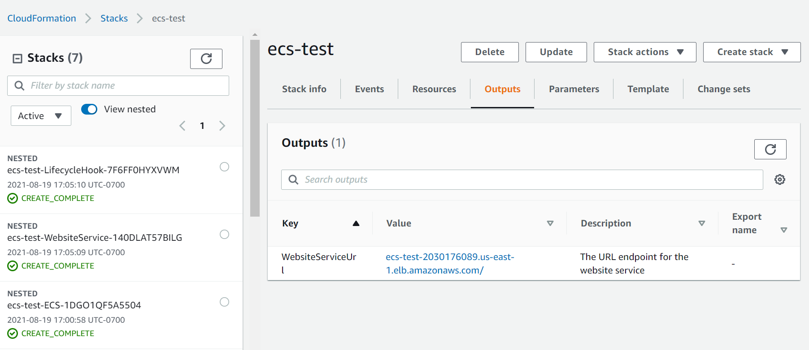

# Deploying webservices with Amazon ECS, AWS CloudFormation, and an Application Load Balancer

## Overview

![infrastructure-overview]

The repository consists of a set of nested templates that deploy the following:

 - A tiered VPC with public and private subnets, spanning an AWS region.
 - A highly available ECS cluster deployed across two Availability Zones in an Auto Scaling group and that are AWS SSM enabled.
 - A pair of NAT gateways (one in each zone) to handle outbound traffic.
 - A webservice deployed as ECS services (website-service). 
 - An Application Load Balancer (ALB) to the public subnets to handle inbound traffic.
 - ALB path-based routes for each ECS service to route the inbound traffic to the correct service.
 - Centralized container logging with Amazon CloudWatch Logs.
 - A Lambda Function and Auto Scaling Lifecycle Hook to drain Tasks from your Container Instances when an Instance is selected for Termination in your Auto Scaling Group.

## Template details

The templates below are included in this repository and reference architecture:

| Template | Description |
| --- | --- | 
| [master.yaml](master.yaml) | This is the master template - deploy it to CloudFormation and it includes all of the others automatically. |
| [infrastructure/vpc.yaml](infrastructure/vpc.yaml) | This template deploys a VPC with a pair of public and private subnets spread across two Availability Zones. It deploys an Internet gateway, with a default route on the public subnets. It deploys a pair of NAT gateways (one in each zone), and default routes for them in the private subnets. |
| [infrastructure/security-groups.yaml](infrastructure/security-groups.yaml) | This template contains the security groups required by the entire stack. They are created in a separate nested template, so that they can be referenced by all of the other nested templates. |
| [infrastructure/load-balancers.yaml](infrastructure/load-balancers.yaml) | This template deploys an ALB to the public subnets, which exposes the various ECS services. It is created in in a separate nested template, so that it can be referenced by all of the other nested templates and so that the various ECS services can register with it. |
| [infrastructure/ecs-cluster.yaml](infrastructure/ecs-cluster.yaml) | This template deploys an ECS cluster to the private subnets using an Auto Scaling group and installs the AWS SSM agent with related policy requirements. |
| [infrastructure/lifecyclehook.yaml](infrastructure/lifecyclehook.yaml) | This template deploys a Lambda Function and Auto Scaling Lifecycle Hook to drain Tasks from your Container Instances when an Instance is selected for Termination in your Auto Scaling Group.
| [services/website-service/service.yaml](services/website-service/service.yaml) | This is a running ECS service accessed via the load-balanced URL. |

## Setup Instructions 

1. prepare build & upload in your s3 bucket as defined in buildspec.yml
2. create cloudFormation stack using s3 object URL of master.yaml file
3. use default options and accept suggested capabilities to create stack

After the CloudFormation templates have been deployed, the stack outputs contain a link to the load-balanced URL for webservice.

The ECS instances should also appear in the Managed Instances section of the EC2 console.

AWS SSM can be used to validate ECS Host (EC2 instances)